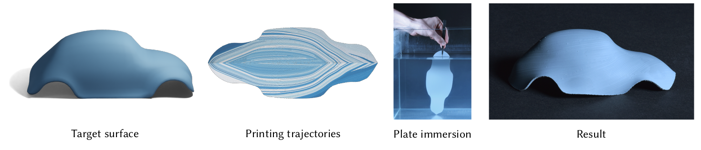

# Shrink & Morph: 3D-printed self-shaping shells actuated by a shape memory effect
[](https://github.com/DavidJourdan/shrink-morph/actions)
David Jourdan, Pierre-Alexandre Hugron, Camille Schreck, Jonàs Martínez, and Sylvain Lefebvre


This repository contains the implementation associated with the paper "Shrink & Morph: 3D-printed self-shaping shells actuated by a shape memory effect"

## Installation instructions

Installation can be done using standard CMake routines. On a typical Linux/macOS machine, the following should work:
```
git clone https://github.com/DavidJourdan/shrink-morph
cd shrink-morph
cmake -B build -DCMAKE_BUILD_TYPE=Release
cmake --build build -j $(nproc)
```
Provided that you have the necessary graphics packages installed (if not the case, see [here](Dependencies.md)) CMake will download the required dependencies and compile the executable.

## Optional dependencies 

These libraries can downloaded for better performance:
- [OR-Tools](https://developers.google.com/optimization/install/cpp/binary_linux): the path where the downloaded archive has been extracted should be specified in the ```${ORTOOLS_PATH}``` variable in ```CMakeLists.txt```.
- [MKL Pardiso](https://www.intel.com/content/www/us/en/developer/tools/oneapi/onemkl-download.html)

## How to run
From the command line, specify which mesh file (stored in ```/data/```) should be opened. For example with ```beetle.obj```  simply run
```
build/shrink-morph beetle
```
To use the togcode script:
```
python togcode.py ../data/input_file.path Creality_K1_Max -o output_file.gcode
```